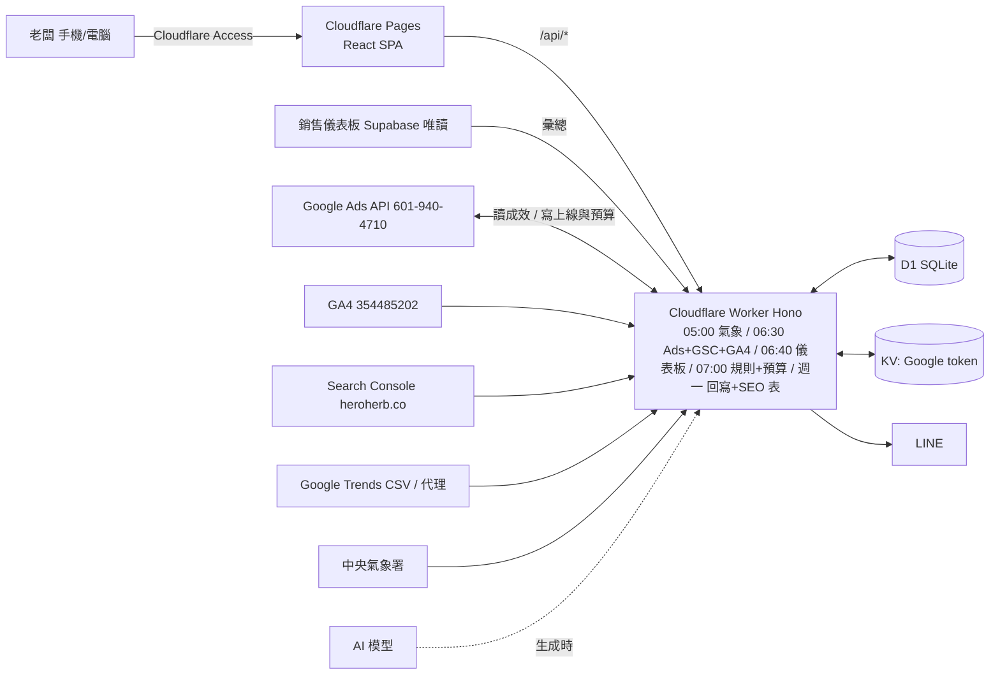
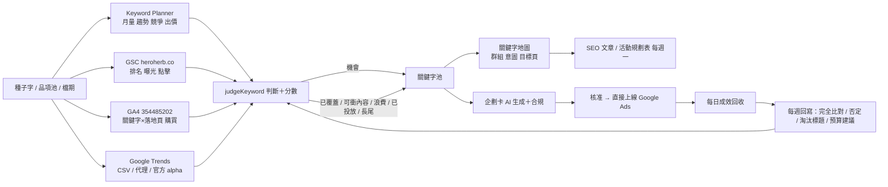

# 好漢草 Google Ads 工具 規劃書（獨立新程式，全 Cloudflare）

版本 1.1　2026-10-06（1.0 → 1.1：加入行事曆擴充、四來源關鍵字閉迴路、SEO 規劃表、每日觀察與預算自動優化、直接上線 Google Ads、上線前串接清單、帳號 ID）
圖文版（含 SVG 流程圖與截圖）：https://claude.ai/artifact/M65RBTe7BaJeM6BtWSVRcw
介面畫布（桌機 3 張、手機 5 張）：https://claude.ai/artifact/6nSuvLeNRpDvKPT84jjiN7 ；原始檔 `docs/design/`
全年清單：`docs/行事曆_全年清單_2026.md`、`docs/行事曆_全年清單_2027.md`

> 老闆決定：**不整合進銷售儀表板，建立新的程式（repo `Google_Ads`）；網站與資料庫都用 Cloudflare；只以唯讀方式抓取儀表板的數據。**

## 1. 定位與原則
- 獨立 repo `Google_Ads`、獨立網址；儀表板一行不改，繼續在 Vercel 跑。
- 全 Cloudflare：網站 Pages、API 與排程 Workers、資料庫 D1、token 存 KV、登入 Cloudflare Access。
- 只讀儀表板：每天 06:40 用唯讀 Postgres 角色從儀表板 Supabase 抓好漢草的營收、廣告費、成本「彙總值」進 D1。
- 所有數字在設定頁改（`shared/settings.js` 共 106 個參數，含預設值）；合規硬關卡；預算與上線前 30 天都是「只建議」模式。

## 2. 帳號與串接對象（金鑰不在此、不進 repo）
| 項目 | 值 | 用途 |
|---|---|---|
| Google Ads 客戶 ID | 601-940-4710（威斯邁） | 成效、搜尋字詞、Keyword Planner、上線 mutate |
| GA4 資源 | 354485202（好漢草QDM_GA4） | 流量、購買、關鍵字 × 落地頁、轉換匯入來源 |
| Search Console | https://www.heroherb.co/ | 排名、曝光（已連結 Ads 6019404710、GA4、Merchant Center） |
| Merchant Center | 好漢草漢方(QDM) | 第二階段購物廣告 |
| 官網 | QDM 開店平台 heroherb.co | 到達網址、GA4 標籤、UTM |

## 3. 架構

## 4. 每日資料流
05:00 氣象 → 06:30 Google Ads 成效（回抓 7 天）、搜尋字詞 30 天、素材標籤、曝光占比流失；GSC 查詢字 × 頁面；GA4 來源 × 活動、關鍵字 × 落地頁 → 06:40 儀表板彙總（日營收 × 通路 × 品類、月廣告費、品項成本）→ 07:00 規則判斷（天氣、CPA、零轉換、浪費字詞）＋ 預算自動優化（第 9 節）＋ 行事曆提前期（第 5 節）→ 警示 → LINE 摘要。每週一：每週回寫、Trends 匯入、SEO 規劃表。畫面只讀 D1。

## 5. 行事曆：24 節氣 × 神明誕辰 × 宗教盛事（提前 2 個月）
`shared/calendar.js`（可直接搬進 Worker 與前端），`npm run calendar:check` 14 項日期自檢全部通過。
- **24 節氣全部列出**，每個節氣有主推品類與文案意象；會觸發企劃卡的 10 個：驚蟄、清明（淨身檔）、寒露、霜降、立冬、小雪、大雪、冬至、小寒、大寒（泡腳季）。其餘只顯示，設定可切換。
- **神明誕辰／成道／飛昇（農曆，每年自動換算）**：媽祖聖誕 3/23、媽祖飛昇成道 9/9、虎爺聖誕 6/6、天公生 1/9、清水祖師 1/6、文昌 2/3、觀音聖誕 2/19・成道 6/19・出家 9/19、玄天上帝 3/3、保生大帝 3/15、註生娘娘 3/20、佛誕 4/8、霞海城隍 5/13、關聖帝君 6/24、七娘媽 7/7、地藏王 7/月底、中壇元帥 9/9、下元 10/15、青山王 10/22。虎爺另與土地公生（2/2）同場；各廟虎爺得道日由廟方公告，用「自訂檔期」補。
- **宗教盛事（12 個）**：鹽水蜂炮、平溪天燈、台東炸寒單（元宵）、內門宋江陣（觀音誕前後）、北港朝天宮迎媽祖（農曆 3/19～23）、保生文化祭（3/15）、白沙屯媽祖進香、大甲媽祖遶境（每年元宵擲筊後公告；2026 已填 4/12～4/20、4/17～4/26）、基隆中元祭（7/1～7/15）、頭城搶孤（7/月底）、東港迎王平安祭典（三年一科，2027 丁未）、艋舺青山王祭（10/20～22）。擲筊決定的活動在未公告年份用農曆估算並標「預估」，公告後在設定「宗教盛事公告日期」填一行即覆寫。
- **提前 60 天出現**（神明誕辰、宗教盛事各自可調）；階段：醞釀（60～31 天：找字、排內容、備貨、聯名洽談）→ 準備（30～8 天：企劃卡、文案、SEO 文章上線）→ 衝刺（7 天內：廣告上線）→ 進行中（預算自動調）→ 已結束（回寫）。
- **全年清單分頁**：依月份列出全部檔期（國曆、農曆、提前天數、主推品類、說明），可切 2026／2027；另有月曆檢視。
- 好漢草的切入點：進香／遶境＝平安包隨身與聯名、**香燈腳走完回家泡腳**（足浴包、足浴袋）、神明誕辰＝平安皂與淨身；日期都有了，內容就能提前兩個月醞釀。

## 6. 關鍵字閉迴路（四來源判斷）

判斷順序（`worker/src/sources.ts judgeKeyword`，門檻全在設定）：已否定 → 浪費（7 天花費 ≥ 500 元且 0 轉換）→ 已投放有轉換（CPA 達標 → 改完全比對）→ GA4 有購買 → GSC 前 3 名已覆蓋 → GSC 4～10 名且曝光 ≥ 500 → 可衝內容（寫文章衝前三）→ 11～30 名可衝內容 → 月量 ≥ 100 且 Trends 上升 > 15% → 機會 → 月量 ≥ 100 且競爭低／中 → 機會 → 出價偏高 → 月量 < 100 長尾 → 觀察。

Google Trends 現況：官方 API 到 2026 年仍是申請制 alpha（無自助申請）。本工具先用 (a) Trends 網頁匯出 CSV 在設定頁匯入（`parseTrendsCsv`）、(b) 選用的代理服務金鑰（SerpApi／DataForSEO）、(c) 申請核准後切官方 API；三種都寫進同一張 `trends_weekly`。

**SEO 文章／活動規劃表**（`worker/src/seo-plan.ts`，每週一產生，寫 `seo_plan`）：60 天內的節氣、神明、盛事各配一篇由來文與一個活動列；「可衝內容／長尾／機會」字依關鍵字地圖群組聚成一篇指南文；排名 4～10 的優先。表格欄位：週、類型（文章／活動）、標題、關鍵字、對應檔期、目標頁、狀態。產出可直接丟給 AI 寫初稿（走第 7 節的合規流程）。

## 7. 企劃卡審核
選檔期＋字 → 組 brief（數字由程式帶入）→ AI 草稿 → 合規掃描 → 有紅字退回重寫（帶意見）／無紅字核准 → 進「上線計畫」（第 8 節）→ 存 briefs、brief_versions、actions。

## 8. 直接上線 Google Ads（plan → validate → apply）
可以。`worker/src/launch.ts` 把核准的企劃卡轉成 Google Ads API `googleAds:mutate` 的操作清單（9 個操作：預算 → 活動（搜尋、台灣 2158、繁中 1018、出價策略）→ 否定字 → 廣告群組 → 關鍵字 → RSA 標題 ≤ 15／描述 ≤ 4、到達網址自動帶 UTM）：
1. **預覽**：畫面列出活動、群組、字數、預算、網址，程式先擋字元數與缺項。
2. **validateOnly=true** 送 Google：字元、政策字、格式錯誤直接回畫面，不會建立任何東西。
3. **apply**：正式建立；預設 `launch.mode=paused`（建好但暫停，老闆在本工具或 Ads 後台按啟用），前 3 檔建議如此；`enabled` 立即投放；`manual` 只給上線文字／Ads Editor CSV。
4. 建立結果（campaign／adGroup／ad resourceName）寫 `launch_plans`、`actions`，後續成效自動對回企劃卡。
前置：Google Ads API **Basic 存取等級**（Explorer 只能讀，mutate 與 Keyword Planner 都要 Basic；需品牌驗證）、developer token、OAuth refresh token（同一組也拿 GA4、GSC 的 scope）。

## 9. 上線後：每日觀察、目標、預算自動優化
`worker/src/budget.ts`，07:00 排程；每個進行中的活動看近 7 天：花費、轉換、CPA／目標、ROAS／目標、曝光占比因預算流失、連續 CPA 超標天數、連續零轉換天數。
| 情況 | 動作 | 預設門檻（設定可改） |
|---|---|---|
| 近 7 天 ROAS ≥ 目標 × 1.2、轉換 ≥ 5 筆、預算流失曝光 ≥ 20%、冷卻已過 | 日預算 +20% | 上限 2,500 元／日、月上限、單日上限 8% 三者取小 |
| 連續 3 天 CPA > 目標 × 1.5、冷卻已過 | 日預算 −20% | 下限 150 元／日 |
| 連續 5 天零轉換且有花費 | 只「建議暫停」，不自動暫停 | 紅色警示 |
| 本月花費達月上限 | 降到下限 | — |
三種模式：`suggest`（預設前 30 天）＝寫建議卡，老闆在「今天要做」按確認才套用；`auto`＝範圍內直接呼叫 `campaignBudgets:mutate`；`off`。每一次（建議或套用）都寫 `budget_log`，進 LINE 摘要與「上線與監控」頁的預算日誌。目標卡：目標 CPA 400、目標 ROAS 3.0、月上限、費率紅燈 8%。

## 10. 上線前串接檢查（heroherb.co 全綠才開放「送上 Google Ads」）
`launch.ts preflight()`，讀 GAQL 與 GA4，結果顯示在「上線與監控」頁：
1. Ads 601-940-4710 ↔ GA4 354485202 已連結（截圖已確認，程式再驗一次）。
2. GSC https://www.heroherb.co/ 已連結 Ads（已確認）；Merchant Center 好漢草漢方(QDM) 已連結（已確認）。
3. **轉換動作**：GA4 `purchase` 匯入 Ads 並設為主要轉換（待做：Ads 後台 → 目標 → 轉換 → 從 GA4 匯入）。
4. 自動標記（gclid）開啟；GA4 的 Google Ads 連結開「自動標記」。
5. 到達網址回 200，頁面含 GA4 標籤（QDM 後台 gtag G-… 或 GTM）；UTM 範本自動帶。
6. 時區 Asia/Taipei、幣別 TWD；（選用）增強型轉換、Consent。
設定 `launch.require_checklist=true` 時未全綠即鎖住上線鈕。

## 11. 介面（畫布連結見上）
| 頁面 | 桌機 | 手機 |
|---|---|---|
| 總覽 | 側欄＋三欄卡片 | 「今天要做」紅卡置頂、四個數字、預算條 |
| **行事曆** | 月曆＋全年清單表 | 60 天內卡片（左色條＝類別、右上階段）／全年清單／月曆三段切換 |
| 關鍵字工作台 | 種子輸入 → 判斷統計 → 四來源比對表 | 判斷分段切換、一字一卡 |
| 企劃卡 | 六格＋紅字＋底部核准列 | 前 5 則標題、替代句、核准鎖住 |
| **上線與監控** | 串接檢查、上線計畫（預覽／再驗證／送上 Google Ads）、每日觀察表、預算日誌、目標卡 | 卡片版 |
| 設定 | 14 群組表單（新增「廣告上線」） | 連線狀態（Ads、GA4、GSC、Trends）、客戶 ID、預算與目標、預算自動優化模式、字級 |
老花規則與顏色制度不變；行事曆左側色條：綠節氣、紅神明、橘盛事、藍電商、紫送禮。

## 12. 模組
`shared/calendar.js`（新，含 24 節氣、神明、盛事、階段、全年清單）、`shared/compliance.js`、`shared/settings.js`（106 參數）、`shared/ai.js`（模型呼叫改由 Worker 注入）、`shared/llm.js`；`worker/src/google.ts`（搬）、`sources.ts`（GSC、GA4、Trends CSV、judgeKeyword）、`budget.ts`、`launch.ts`、`seo-plan.ts`、`weather.ts`（搬）；待寫：Hono 路由＋Access 驗證（以舊 index.ts 為樣板改 D1）、dashboard-pull.ts、rules.ts、weekly.ts、前端六頁。

## 13. 資料表（D1，`worker/schema.sql`）
settings、sales_daily、sales_monthly_costs、ads_daily（含曝光占比流失）、search_terms、ad_assets、gsc_daily、**ga4_daily、trends_weekly**、keyword_ideas、keyword_pool（四來源欄位）、**keyword_map、seo_plan、calendar_overrides**、title_library、briefs、brief_versions、**launch_plans、budget_log**、actions、weather_daily、alerts、suggestions、experiment_log、sync_log。

## 14. 登入與安全
Cloudflare Access（Google 帳號白名單）；角色 admin／manager／viewer；所有金鑰 Worker secret；儀表板只給 SELECT 角色、查詢固定 brand＝好漢草；寫 Google Ads 的操作（上線、預算）都要 admin 或 manager，且每筆寫 actions／budget_log。

## 15. 階段
| 階段 | 內容 | 估時 | 前置 |
|---|---|---|---|
| 0 | repo `Google_Ads`、Cloudflare 專案（Pages、Worker、D1、KV、Access）、儀表板唯讀角色 | 0.5 天 | GitHub 建 repo 並授權 Claude App；Cloudflare 帳號 |
| 1 | D1 schema、設定中心、儀表板彙總同步、總覽、**行事曆（60 天／全年／月曆）** | 2 天 | — |
| 2 | Google OAuth（Ads＋GA4＋GSC scope）、帳號、成效／GA4／GSC 同步、上線前串接檢查 | 1.5 天 | Google Cloud OAuth 用戶端、Explorer 等級 |
| 3 | 關鍵字工作台（四來源判斷、池、地圖）、Trends CSV 匯入、SEO 規劃表 | 2 天 | Basic 等級（Keyword Planner） |
| 4 | 企劃卡（AI、合規、審核） | 1 天 | AI 金鑰 |
| 5 | 上線計畫 plan／validate／apply（paused）、每日觀察、預算 suggest 模式、LINE | 2 天 | Basic 等級、GA4 purchase 匯入 Ads |
| 6 | 氣象規則、每週回寫、預算 auto 模式（30 天 suggest 紀錄後開）、Merchant Center | 1.5 天 | 氣象授權碼 |
合計約 10.5 個工作天。
