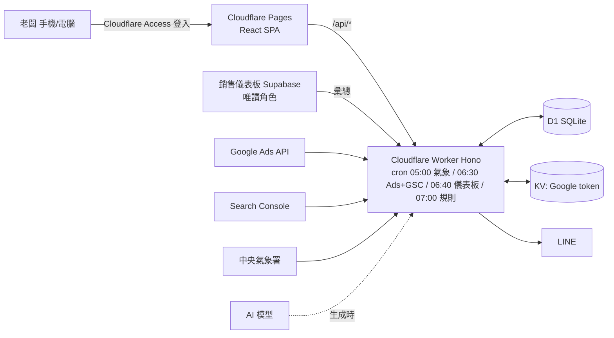
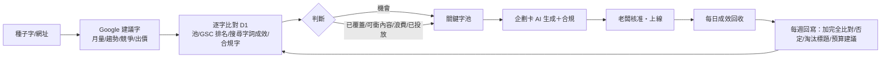

# 好漢草 Google Ads 工具 規劃書（獨立新程式，全 Cloudflare）

版本 1.0　2026-10-06
圖文版（含 SVG 流程圖與現況截圖）：https://claude.ai/artifact/M65RBTe7BaJeM6BtWSVRcw
介面畫布（桌機 2 張、手機 4 張）：https://claude.ai/artifact/6nSuvLeNRpDvKPT84jjiN7
現況截圖：`docs/screens/`（儀表板分支原型，僅供對照）

> 老闆 2026-10-06 決定：**不整合進銷售儀表板，建立新的程式；網站與資料庫都用 Cloudflare；只以唯讀方式抓取儀表板的數據。**
> 本分支（docs/google-ads-ga-gsc-plan）上的行銷作戰室程式碼不合併進儀表板 main，只當模組來源與介面參考。

## 1. 定位與原則
- 獨立 repo、獨立網址；儀表板一行不改，繼續在 Vercel 跑。
- 全 Cloudflare：網站 Pages、API 與排程 Workers、資料庫 D1、token 存 KV、登入 Cloudflare Access。
- 只讀儀表板：每天 06:40 用唯讀 Postgres 角色從儀表板 Supabase 抓好漢草的營收、廣告費、成本「彙總值」進 D1。
- 所有數字在設定頁改；合規硬關卡；前三個月人工上線。

## 2. 架構

## 3. 每日資料流
05:00 氣象 → 06:30 Google Ads 成效、搜尋字詞、素材標籤、GSC → 06:40 儀表板彙總（日營收×通路×品類、月廣告費、品項成本）→ 07:00 規則判斷（天氣、CPA、零轉換、浪費字詞）→ 警示 → LINE。畫面只讀 D1。

## 4. 關鍵字閉迴路

## 5. 企劃卡審核
選檔期＋字 → 組 brief（數字由程式帶入）→ AI 草稿 → 合規掃描 → 有紅字退回重寫（帶意見）／無紅字核准 → 複製上線文字 → 標記上線 → 存 briefs、actions。

## 6. 介面
| 頁面 | 桌機 | 手機 |
|---|---|---|
| 總覽 | 側欄＋三欄卡片 | 「今天要做」紅卡置頂、四個數字、預算條 |
| 關鍵字工作台 | 種子輸入 → 判斷統計 → 比對表（勾選、批次） | 判斷分段切換、一字一卡、底部加入池/出企劃卡 |
| 企劃卡 | 六格＋紅字＋底部核准列 | 前 5 則標題、替代句、核准鎖住提示 |
| 成效 | 各活動花費/CPA/ROAS、素材標籤 | 卡片 |
| 設定 | 12 群組表單 | 連線、客戶 ID、預算目標、字級 |

老花規則：內文 18px、標籤 16px、重點數字 40/32/24、深墨色、可點 ≥ 56px、底部分頁 72px、A+ 放大。顏色＝判斷：綠機會、藍已覆蓋、紫可衝內容、橘注意、紅浪費/違規。

## 7. 模組（可從本分支搬）
`shared/compliance.ts`（← marketingCompliance.js）、`shared/calendar.ts`（← marketingCalendar.js）、`shared/settings.ts`（← marketingDefaults.js）、`worker/src/google.ts`（← workers/google-sync/src/google.ts）、`worker/src/weather.ts`（← weather.ts）、`worker/src/ai.ts`（← marketingAI.js，金鑰改 secret）；新寫：Hono 路由與 Access 驗證、gsc.ts、dashboard-pull.ts、rules.ts、weekly.ts、前端五頁。

## 8. 資料表（D1）
settings、sales_daily、sales_monthly_costs、ads_daily、search_terms、ad_assets、gsc_daily、keyword_ideas、keyword_pool、title_library、briefs、brief_versions、actions、weather_daily、alerts、suggestions、experiment_log、sync_log。

## 9. 登入與安全
Cloudflare Access（Google 帳號白名單）；角色 admin/manager/viewer；所有金鑰在 Worker secret，瀏覽器不持有；儀表板只給 SELECT 權限的角色、查詢固定 brand＝好漢草。

## 10. 階段
| 階段 | 內容 | 估時 | 前置 |
|---|---|---|---|
| 0 | repo、Cloudflare 專案、儀表板唯讀角色 | 0.5 天 | repo 名稱、Cloudflare 帳號 |
| 1 | D1 schema、設定中心、儀表板彙總同步、總覽 | 1.5 天 | — |
| 2 | Google OAuth、帳號、成效同步、成效頁 | 1 天 | OAuth 用戶端、Explorer |
| 3 | 關鍵字工作台（建議、比對、判斷、池） | 1.5 天 | Basic（關鍵字建議）、GSC scope |
| 4 | 企劃卡（AI、合規、審核、上線文字） | 1 天 | AI 金鑰 |
| 5 | 氣象與規則引擎、LINE、每週回寫 | 1.5 天 | 氣象授權碼 |
| 6 | Ads API 直接上線、天氣檔自動暫停、GA4 | 2 天 | Basic、三個月紀錄 |

第一階段約 7 個工作天。
