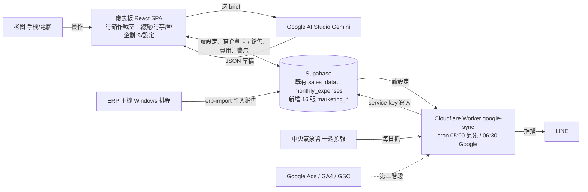
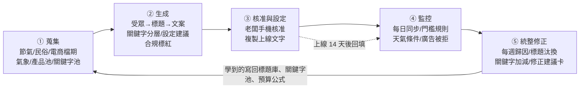
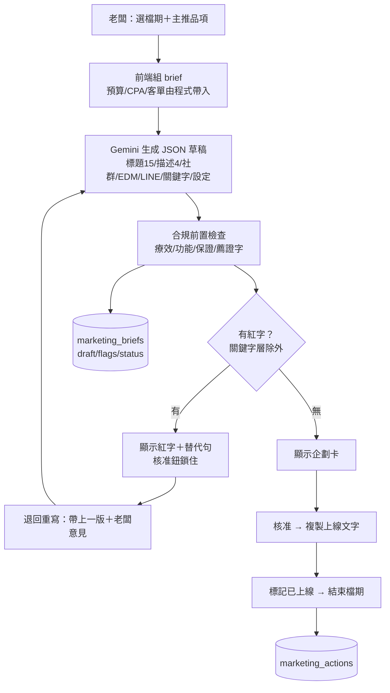
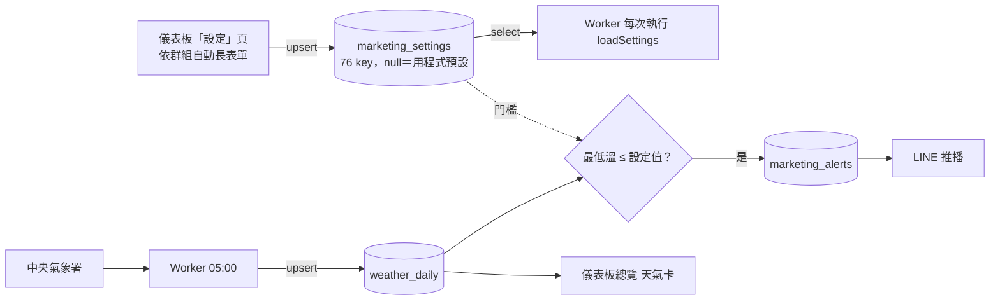

# 好漢草行銷作戰室 程式規劃書

版本 v0.0.145　更新 2026-10-06　範圍：好漢草品牌
圖文版（手機可讀、含 SVG 流程圖）：https://claude.ai/artifact/TKiB98TYzXKVubEy4YNfXv
相關文件：`行銷內容自動化迴圈規劃.md`（完整規劃）、`Google廣告_GA_GSC串接規劃.md`（資料同步）、`數位行銷頁面介面設計.md`（介面規則）、`../workers/google-sync/README.md`（部署）

## 1. 目的與範圍

把好漢草的行銷做成一條自動跑的迴圈：系統蒐集節氣、天氣、電商檔期、產品與關鍵字，提前提醒該出哪一檔；AI 寫標題、文案、受眾與投放設定；藥事法合規檢查自動標紅；老闆手機核准；上線後每天監控；每週把學到的寫回資料庫。

- 只做好漢草：平安包（近半營收）、足沐湯浴包四款、感溫足浴袋、擦澡包、淨境噴霧、平安皂。
- 合規是硬關卡：紅字沒改完不能核准。
- 前三個月人工核准，自動化的是蒐集、生成、監控、建議。
- 76 個參數全在「設定」頁改，Worker 下次執行即生效。

## 2. 系統全貌

## 3. 五段迴圈

| 段 | 輸入 | 處理 | 輸出 | 狀態 |
|---|---|---|---|---|
| ① 蒐集 | solarlunar 節氣、內建民俗與電商清單、氣象署 | `marketingCalendar.js`、Worker | 行事曆、`weather_daily` | 行事曆／氣象完成；關鍵字與標題庫同步待做 |
| ② 生成 | 檔期＋品項＋設定＋關鍵字組 | `marketingAI.js` → Gemini → `marketingCompliance.js` | `marketing_briefs` | 完成 |
| ③ 核准 | 企劃卡 | 核准／退回重寫／作廢；複製 Google Ads Editor 文字 | status、`marketing_actions` | 完成；API 自動上線第二階段 |
| ④ 監控 | 氣象、設定門檻 | Worker 規則引擎 | `marketing_alerts`、LINE | 天氣規則完成；CPA／費率／素材待做 |
| ⑤ 修正 | 日表×銷售×行事曆×天氣 | 每週一 | `marketing_suggestions`、`experiment_log` | 待做 |

## 4. 企劃卡生成流程

## 5. 設定中心與天氣觸發

## 6. 模組說明

| 模組 | 職責 | 狀態 |
|---|---|---|
| `src/config/marketingDefaults.js` | 76 個參數定義與預設、12 群組；單一真相 | 完成 |
| `src/hooks/useMarketingSettings.js` | 讀寫 `marketing_settings`，只存改過的值；匯出／匯入 | 完成 |
| `src/hooks/useFontScale.js` | 全站字級 16／18／20／24 與高對比 | 完成 |
| `src/utils/marketingCalendar.js` | 24 節氣、12 民俗、12 電商／送禮、自訂檔期；提前天數與倍率讀設定 | 完成 |
| `src/utils/marketingCompliance.js` | 18 條藥事法規則掃描與替代句；關鍵字層不掃 | 完成 |
| `src/utils/marketingAI.js` | 組 prompt、呼叫 Gemini、退回重寫、匯出 Editor 文字 | 完成 |
| `src/components/marketing/MarketingHub.jsx` | 總覽／行事曆／企劃卡／設定四子頁 | 完成 |
| `supabase/migrations/20261006000000_marketing_core.sql` | 16 張表、RLS、76 筆種子（正式庫已套用） | 完成 |
| `workers/google-sync/` | 氣象抓取、天氣規則、警示、LINE；Google 同步預留 | 程式完成，待部署 |
| Google 同步、監控規則引擎、每週統整、回購／備貨／折扣／漏斗／SEO／競品 | 規劃第 13 節 | 待做 |

## 7. 資料表

`marketing_settings`、`marketing_calendar`、`weather_daily`、`marketing_rules`、`keyword_pool`、`title_library`、`content_library`、`marketing_briefs`、`marketing_actions`、`marketing_alerts`、`marketing_suggestions`、`experiment_log`、`google_sync_log`、`google_ads_daily`、`ga4_daily`、`gsc_daily`。RLS：登入可讀，manager 以上可寫；`marketing_settings` 的 admin 欄位只有 admin 可改；Worker 用 service key。

## 8. 權限與安全

- viewer 只看；manager 核准企劃卡、改一般設定；admin 改預算上限、品牌範圍、合規開關。
- Gemini 金鑰存瀏覽器；Worker 機密走 `wrangler secret`。
- 待處理：`.claude/settings.local.json` 曾提交 service_role key，要換 key 並停止追蹤。

## 9. 老闆操作手冊

1. 早上看 LINE 的天氣觸發或警示。
2. 儀表板 → 行銷作戰室 → 總覽：檔期提示卡、天氣卡、預算進度。
3. 企劃卡 → 新企劃卡 → 選檔期 → 生成 → 看紅字 → 退回重寫或核准 → 複製上線文字。
4. 上線後按「標記已上線」，結束按「結束檔期」。
5. 數字在設定頁改；字太小按右上 A+。

## 10. 進度

| 階段 | 內容 | 狀態 |
|---|---|---|
| A | 設定中心、行事曆、資料表、氣象 Worker | 完成 v0.0.145 |
| C（提前） | AI 企劃卡＋合規硬關卡＋核准流程 | 完成 |
| 部署 | 換 Supabase key；`npm run deploy`；Worker `wrangler login`→3 個 secret→`deploy`；設定頁填語氣與事實句 | 老闆動手 |
| B／D／E／F | 關鍵字與標題庫、回購推播、監控規則、每週修正 | 待做（部分需 Google 存取等級、QDM API、lc-inspect） |
| G | AI 全自動、Ads API 上線、搬 Cloudflare Pages | 第二階段 |

第一檔試跑：立冬暖身檔（11/07，提前 7 天，足沐湯浴包＋感溫足浴袋）。
